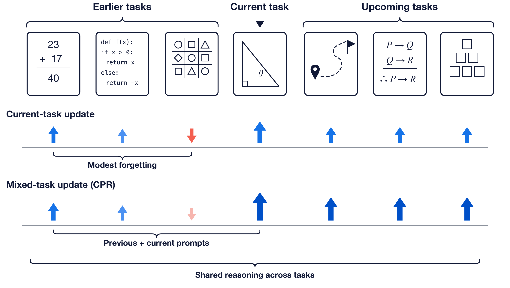

<div align="center">

# Continual Reasoning Gym: Diagnosing and Harnessing Shared Reasoning in Continual RLVR

**Official implementation of Continual Reasoning Gym (CRG) and Continual Prompt Replay (CPR)**

**Lirui Luo · Guoxi Zhang · Hongming Xu · Rongqing Li · Cong Fang · Lifeng Fan**

[](https://crg-rl.github.io/)
[](https://github.com/crg-rl/crg)
[](mllm-crl/pyproject.toml)
[](https://pytorch.org/)
[](LICENSE)

</div>

<p align="center">
  
</p>

> **TL;DR** Sequential RLVR forgets modestly but still trails multitask RLVR. CRG identifies **shared reasoning** as an explanation for the modest forgetting, and CPR harnesses it by replacing part of each current-task batch with previous-task prompts whose responses are regenerated by the current policy. CPR is the only evaluated continual-learning method that reaches MTRL-level performance on average.

## Overview

Continual RLVR updates a reasoning model as new tasks arrive instead of rerunning joint training over the enlarged task mixture. CRG turns this setting into a reproducible training and evaluation environment with five task sequences spanning text and visual reasoning, 30 stages, stage-wise training, and all-task evaluation.

The paper finds two linked observations. Sequential RLVR retains earlier tasks relatively well, yet reaches only 88% of the multitask RLVR reference on average. Shared reasoning explains why updates on one task can benefit others on average. CPR brings previous-task prompts back into current-policy training to use this shared structure for learning the arriving and future tasks. It reaches a mean continual-to-multitask ratio of 1.03 without increasing the number of prompts or rollouts per update.

This repository contains the paper's task streams, reward functions, training entry points, evaluation metrics, five continual-learning interventions, the Muon optimizer control, CPR, and the current-policy-regeneration ablation.

## Highlights

- Five continual-RLVR task sequences: two Reasoning Gym settings and three VisuLogic settings
- Sequential and multitask RLVR, five CL interventions, and the Muon optimizer control
- Continual Prompt Replay with current-policy response regeneration
- CRL metrics including BaseAvg, FinalAvg, FWT, TLG, BWT, and CTM
- Released VisuLogic subtype annotations and deterministic data preparation
- Pinned VERL integration used by the paper

## Quick Start

CRG supports Python 3.11 and 3.12 with PyTorch 2.8.x, vLLM 0.11.x, and NVIDIA GPUs. Install CUDA-compatible PyTorch and vLLM wheels for your machine before running the setup script.

```bash
git clone https://github.com/crg-rl/crg.git
cd crg

python3 -m venv .venv
source .venv/bin/activate
python -m pip install --upgrade pip
# Install the PyTorch and vLLM builds appropriate for your CUDA runtime.

bash scripts/setup.sh
export VERL_CONFIG_ROOT="$(python scripts/locate_verl_config.py)"
python scripts/check_environment.py
```

Run the minimal CPR validation path:

```bash
MODEL_PATH=Qwen/Qwen3-4B \
N_GPU=1 \
bash scripts/smoke_cpr_llm.sh
```

This validation crosses one task boundary so the second update contains previous-task prompts regenerated by the current policy.

Run the full 500-update LLM algorithmic experiment on eight GPUs:

```bash
MODEL_PATH=Qwen/Qwen3-4B \
N_GPU=8 \
bash scripts/train_llm.sh cpr algorithmic
```

Hydra overrides supplied after the setting are forwarded to the underlying launcher.

## Installation

### Prerequisites

1. Python 3.11 or 3.12
2. NVIDIA GPUs with a CUDA runtime supported by PyTorch 2.8.x
3. vLLM 0.11.x
4. Git and a C/C++ toolchain

### Environment setup

`scripts/setup.sh` checks out VERL at
`adff7956cefd8ef707cd67dd8e08c06fa63679bd`, applies the CRG runtime patch,
checks out the OSFT `mini_trainer` dependency at
`f5d63c202eedd7ede7a7ab074f41a0a080b88af8`, and installs both local Python
packages in editable mode.

```bash
bash scripts/setup.sh
export VERL_CONFIG_ROOT="$(python scripts/locate_verl_config.py)"
```

The setup script deliberately leaves PyTorch and vLLM installation to the user because their wheels depend on the local CUDA runtime.

## Data Preparation

### Text reasoning

The two text settings are generated procedurally with `reasoning-gym==0.1.24`. Their task definitions and generation parameters are in:

```text
mllm-crl/mllm_crl/task/reasoning_gym/config/
```

No external text dataset download is required.

### Visual reasoning

Download VisuLogic-Train and prepare each CRG setting with the released subtype annotations:

```bash
python scripts/prepare_visulogic.py \
  --setting quantitative \
  --source-jsonl /path/to/VisuLogic-Train/visulogic_train_qwen.jsonl \
  --image-root /path/to/VisuLogic-Train \
  --out-root ./data/visulogic
```

Repeat with `--setting spatial` and `--setting positional`. Each command writes deterministic `train.parquet` and `val.parquet` files using the 80/20 split and the corresponding annotation file under `data/visulogic_subtypes/`.

Set `VISULOGIC_DATA_ROOT` to the prepared setting directory before launching a visual experiment. The official upstream resources are:

- Dataset: <https://huggingface.co/datasets/VisuLogic/VisuLogic-Train>
- Source and images: <https://github.com/VisuLogic-Benchmark/VisuLogic-Train>
- Evaluation code: <https://github.com/VisuLogic-Benchmark/VisuLogic-Eval>

## Running Experiments

### LLM task sequences

```bash
# Sequential RLVR
bash scripts/train_llm.sh seq_rlvr algorithmic
bash scripts/train_llm.sh seq_rlvr algebra

# Multitask RLVR reference
bash scripts/train_llm.sh mtrl algorithmic
bash scripts/train_llm.sh mtrl algebra

# Continual Prompt Replay
bash scripts/train_llm.sh cpr algorithmic
bash scripts/train_llm.sh cpr algebra

# CL interventions and optimizer control
bash scripts/train_llm.sh ewc algorithmic
bash scripts/train_llm.sh fire algorithmic
bash scripts/train_llm.sh kl algorithmic
bash scripts/train_llm.sh muon algorithmic
bash scripts/train_llm.sh osft algorithmic
bash scripts/train_llm.sh redo algorithmic
```

### VLM task sequences

The visual launchers are grouped by setting under:

```text
mllm-crl/example_scripts/visulogic/
continual-rlvr-algorithms/example_scripts/visulogic/
```

Each setting includes sequential RLVR and CPR launchers. The MTRL launchers are under `mllm-crl/example_scripts/visulogic/multitask/`.

### Outputs

`scripts/train_llm.sh` writes experiment directories under `outputs/` by default. Set `OUTPUT_ROOT` to place checkpoints and logs on another filesystem.

## Evaluation

The evaluation package provides CRL matrix materialization, BaseAvg, FinalAvg, FWT, TLG, BWT, CTM, text ability evaluation, VLM ability evaluation, and generated-token entropy diagnostics.

```bash
python -m unittest tests.test_crl_metrics -v
python -m evaluation.crl_metric --help
```

The CRL metric input uses `performance_matrix[row][column]` for the checkpoint after stage `row` evaluated on task `column`.

## Repository Layout

```text
continual-rlvr-algorithms/  CPR and continual-learning methods
mllm-crl/                   Task streams, rewards, and evaluation
patches/                    Pinned VERL integration patch
scripts/                    Setup, data preparation, and public launchers
data/                       Compact CRG task annotations
validation/                 Tensor-level regeneration/replay contract
assets/                     README figures
```

The CPR sampler is implemented in
`continual-rlvr-algorithms/continual_rlvr_algorithms/method/prompt_replay/`.
The task streams are implemented in `mllm-crl/mllm_crl/task/`.

## Verification

CPU-side checks:

```bash
PYTHONPATH="$PWD/mllm-crl:$PWD/continual-rlvr-algorithms" \
  python -m unittest tests.test_crl_metrics tests.test_visulogic_prepare -v

python -m compileall -q mllm-crl continual-rlvr-algorithms scripts tests validation
find . -type f -name '*.sh' -print0 | xargs -0 -n1 bash -n
```

After installing the GPU stack, run:

```bash
python scripts/check_environment.py
bash scripts/smoke_cpr_llm.sh

PYTHONPATH="$PWD/continual-rlvr-algorithms" \
  python validation/test_stale_trajectory_contract.py
```

## Citation

If you find this repository useful, please cite:

```bibtex
@article{luo2026continualreasoninggym,
  title   = {Continual Reasoning Gym: Diagnosing and Harnessing Shared Reasoning in Continual RLVR},
  author  = {Luo, Lirui and Zhang, Guoxi and Xu, Hongming and Li, Rongqing and Fang, Cong and Fan, Lifeng},
  journal = {arXiv preprint},
  year    = {2026}
}
```

## License

This project is released under the [MIT License](LICENSE). Third-party components and datasets retain their original licenses; see [THIRD_PARTY.md](THIRD_PARTY.md).
